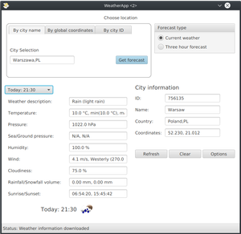
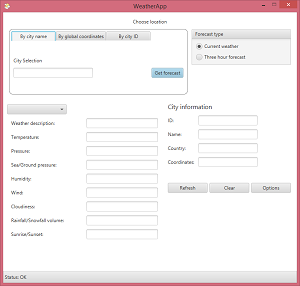

# WeatherApp
WeatherApp i a weather application provading current weather and weather forecast. It uses RESTful API provided by https://openweathermap.org/. It features displaying current weather or three hour forecast for next 5 days, based on city, global coordinates or internal city ID.

Application is written with Java and OpenJFX. Minimal supported java version is 10. Preview (Windows and Linux):

<p align="center">
  
  
</p>

## Release versions

## Build and run
Note: Java 10 or higher is required to build and run this package.
#### Getting the source code
To get source code use the following commands:
```
git clone https://github.com/artudi54/WeatherApp
cd WeatherApp
```
#### Compiling and running the application
To compile and distribute the application type:
```
mvn package
```
It will create 'WeatherApp' subdirectory containing ready to run application. Tu run it open 'WeatherApp.jar' file in your favourite file manager or use command:
```
java -jar WeatherApp/WeatherApp.jar
```
To run the code using maven enter:
```
mvn compile exec:java
```

## Importing the project in IntelliJ-IDEA
In intelliJ menu go to:
```
Import project
```
Then navigate to 'WeatherApp' directory and select 'pom.xml'. Complete the import dialog selecting JDK 10 or newer.
After the project is open perform:
```
Add Configuration.. -> + -> Maven
```
Enter the name of the configuration (e.g. Weather App) and add folowing arguments to 'Command line:'
```
-q compile exec:java
```
Accept configuration settings. Your project should be fully configured and runnuble now (Shift+F10).
